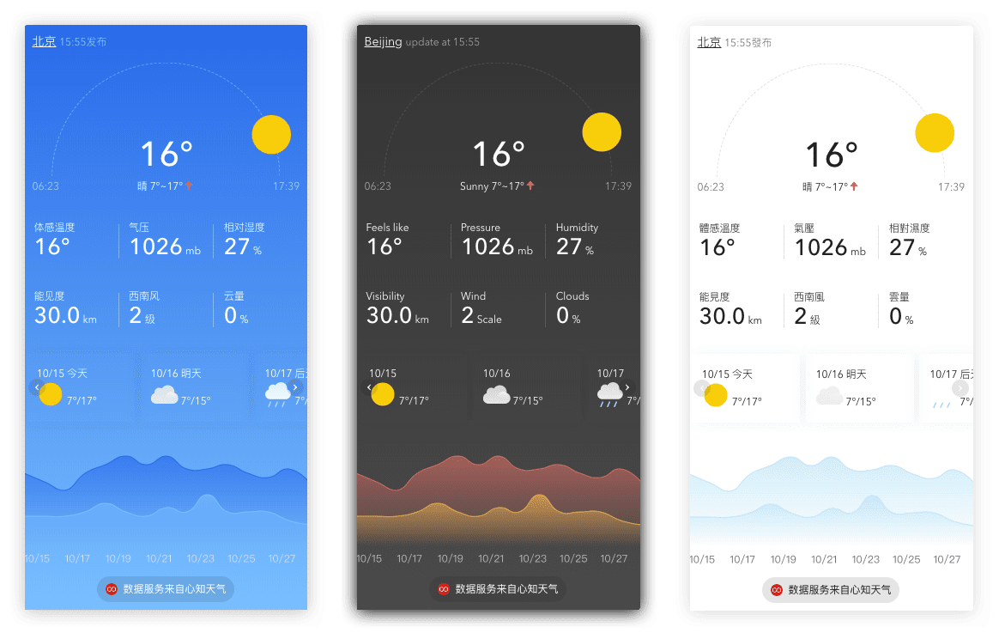

# widget-v3-frontend



心知天气v3版插件，一款简洁美观的免费开源天气插件，为您的 WEB 及 APP 提供更加快速准确且灵活的天气预报功能

## 如何开始

1. clone 源代码到本地

    ```bash
    $ git clone
    $ cd widget-v3-frontend
    $ npm i
    ```

1. 启动 [widget-v3-server](https://github.com/seniverse/widget-v3-server)，将 `npm run init` 中生成的 Token 复制下来，填写到 [`src/containers/Playground/index.tsx`](./src/containers/Playground/index.tsx) 对应的位置

1. 启动 dev-server

    ```bash
    $ npm run start
    ```

## 项目结构

```
┌── config                  # webpack 等配置文件
├── public                  # 公共资源存放
├── scripts                 # 开发部署时使用的脚本
└── src                     # 项目源码
    ├── api                 # 通信基类以及后端交互接口
    ├── components          # 公用组件
    ├── containers          # 公用组件
    |   ├── App             # 程序主入口
    |   ├── Carousel        # 轮播式卡片
    |   ├── Chart           # 图表式卡片
    |   ├── Main            # 主卡片，每个配置中都有
    |   ├── Playground      # 本地开发入口，可以在此修改处传入不同参数调试
    |   ├── Tile            # 磁贴式卡片
    |   └── UiManager       # 卡片管理器
    ├── types               # ts 接口声明
    ├── utils               # 样式、时间处理等公用函数
    └── index.tsx           # 入口文件
```

## License

[Apache License 2.0](https://github.com/seniverse/widget-v3-frontend/blob/master/LICENSE)
